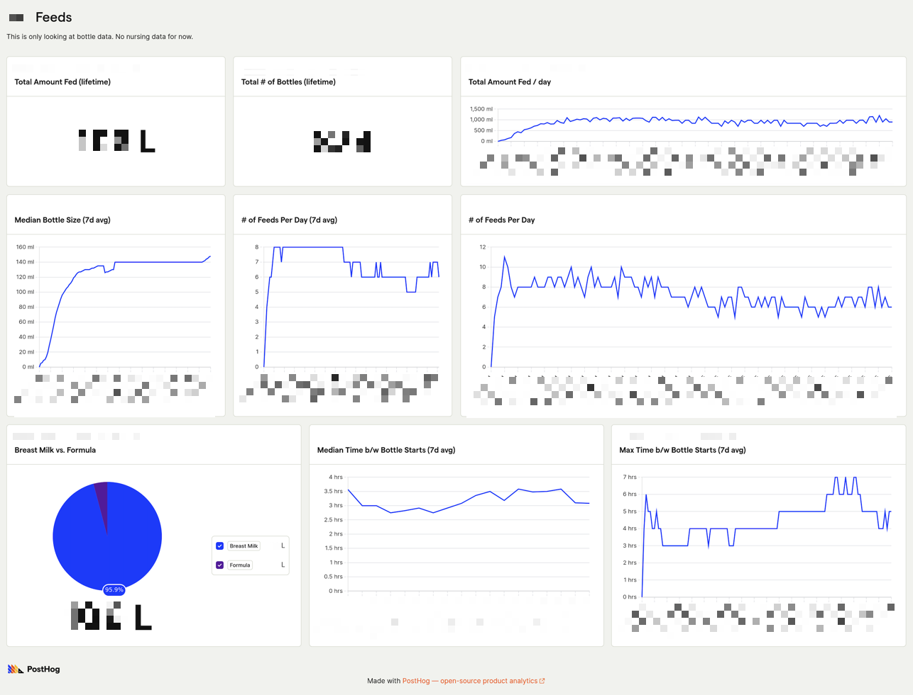
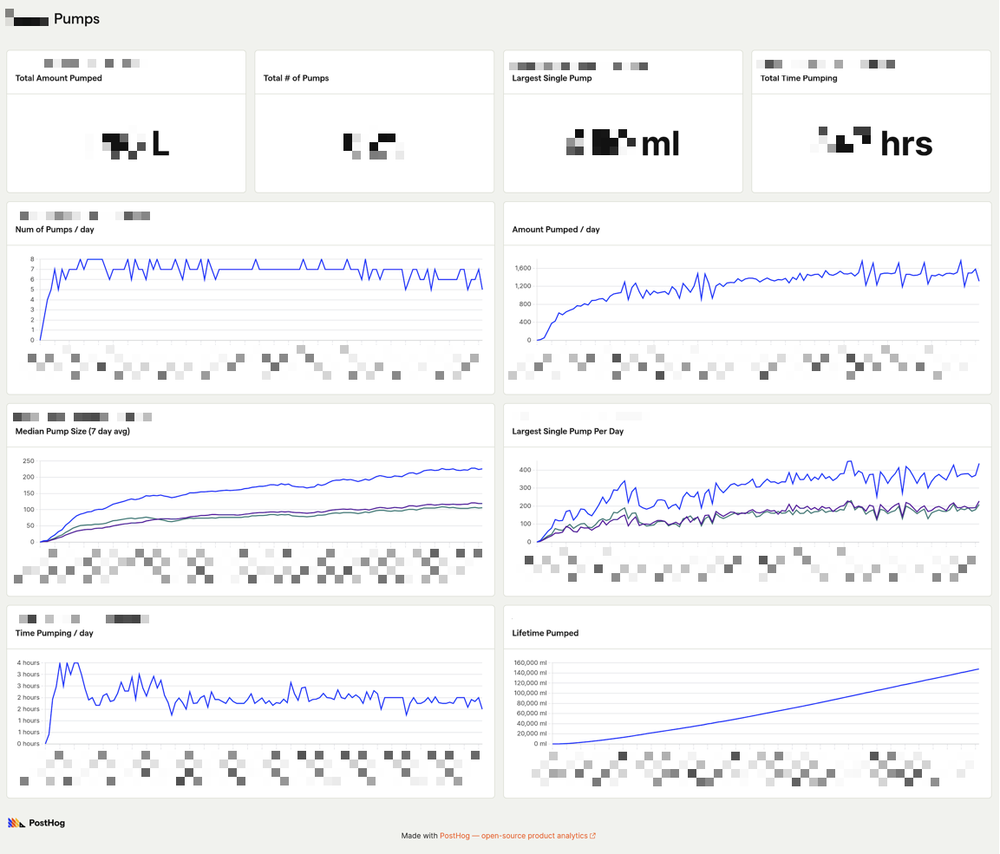
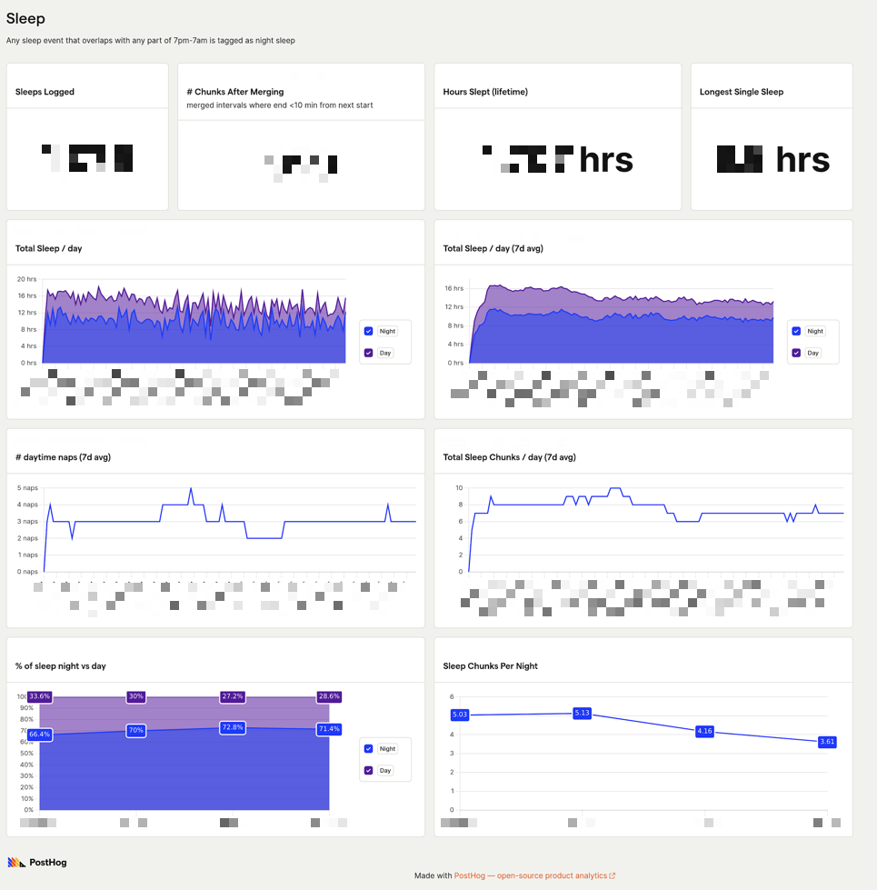
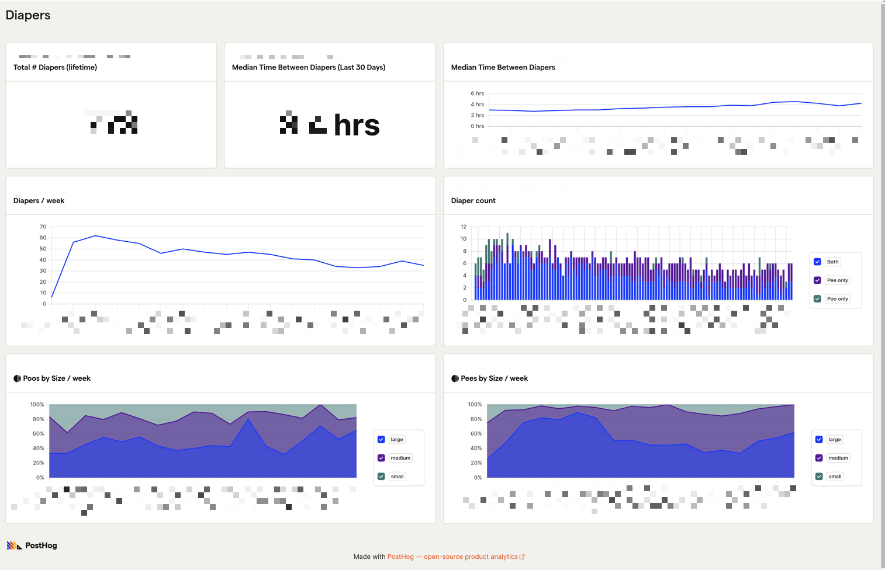

# Huckleberry to Posthog

Parse Huckleberry export csv into Posthog events for self-serve analytics  

---

Huckleberry's built-in analytics are pretty basic and hard to navigate on mobile-only.

I wanted to explore the data in an analytics tool and Posthog had a generous free tier.

To get your huckleberry export:
https://huckleberry.zendesk.com/hc/en-us/articles/5055945148819-Can-I-export-my-data-from-the-app

# Example Posthog Dashboards
*dates blurred for privacy*  

  

  

  

